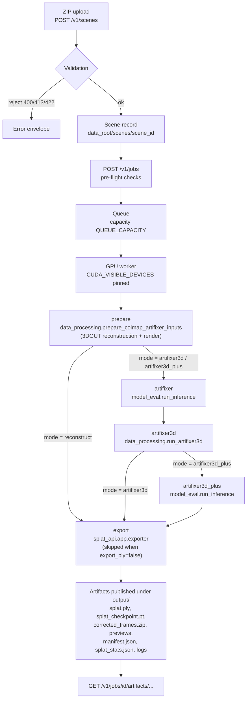

<!-- SPDX-FileCopyrightText: Copyright (c) 2026 NVIDIA CORPORATION & AFFILIATES. All rights reserved. -->
<!-- SPDX-License-Identifier: Apache-2.0 -->

# splat_api pipeline

How a ZIP upload becomes a Gaussian splat. Every stage is one subprocess running an
ArtiFixer repo module; `splat_api/app/pipeline.py` is the only place that knows the
repo's CLI contract and output layout, and it is pure — it computes argv lists and
paths but never runs anything.

Contents: [Flow](#flow) · [Training views](#training-views-and-the-validation-holdout) ·
[Modes](#modes) · [Stages](#stages) · [On-disk layout](#on-disk-layout) ·
[Scheduling](#scheduling-concurrency-and-caching) ·
[Measured runtime](#measured-runtime-a-verified-reconstruct-run) ·
[Source references](#source-references) ·
[Configuration](#configuration-pipeline-and-scheduler)

---

## Flow



Validation happens in two phases, both before anything is queued:

1. **Archive** — `splat_api/app/archives.py` plans the extraction from the ZIP
   central directory alone, so every structural rejection (bomb ratios, member
   caps, missing sparse files, duplicate basenames, too many images) happens
   before the first byte hits disk. Only `images/<name>` and
   `sparse/0/{cameras,images,points3D}.bin` are ever written.
2. **COLMAP model** — `splat_api/app/colmap_input.py` reads the sparse model with a
   dependency-free reader and duplicates the assertions in
   `data_processing/prepare_colmap_artifixer_inputs.py`, so a bad scene is a clean
   HTTP 422 at submit time rather than a subprocess traceback minutes into a job.

Rules for both phases are tabulated in
[API.md](API.md#input-contract).

---

## Training views and the validation holdout

Before a job is queued, `routes.resolve_training_views` decides which of the scene's
images become 3DGRUT training anchors. This is not a pass-through of the request:

| Request | Training anchors | `validation_holdout_auto` |
| --- | --- | --- |
| `selected_image_names` supplied | Exactly those names, verbatim | `false` |
| `selected_image_names` omitted | Every image **except** every 8th (`index % 8 != 0`) | `true` |

Either way the resolved list is written to
`inputs/selected_train_images.txt` and passed to `prepare` as
`--selected_image_names_file`, so the flag is *always* present on the `prepare`
command line and the prepared scene always contains a `selected_indices.json`.

### Why views must be held back

3DGRUT builds a **validation** `ColmapDataset` alongside the training one
unconditionally
(`thirdparty/3DGRUT-ArtiFixer/threedgrut/datasets/__init__.py:46-56`). When a
selected-indices file is present, the two splits are defined against each other
(`threedgrut/datasets/dataset_colmap.py:101-104`):

```python
if self.split == "train":
    indices = selected_indices[:self.num_selected_indices]
elif self.split == "val":
    indices = np.setdiff1d(indices, selected_indices[:self.num_selected_indices])
```

So selecting *every* image makes the validation split empty. `ColmapDataset.__init__`
then calls `compute_spatial_extents` over zero cameras and training dies during
dataset construction, before a single optimization step:

```text
IndexError: min(): Expected reduction dim 0 to have non-zero size.
```

This was reproduced against the real engine, not inferred from reading the code.

There is no way to opt out through the public CLI:
`data_processing/prepare_colmap_artifixer_inputs` always writes
`selected_indices.json` and always passes `selected_indices_file=` to 3DGRUT — when
no `--selected_image_names_file` is given, `resolve_selected_indices` simply defaults
to *all* indices, which is precisely the crashing case. Holding views back is
therefore the only viable route, and the API does it for the caller rather than
letting the job fail 30 seconds into the `prepare` stage.

The interval is `routes.VALIDATION_HOLDOUT_INTERVAL = 8`, chosen to match the
engine's own `test_split_interval: 8`
(`thirdparty/3DGRUT-ArtiFixer/configs/dataset/colmap.yaml:3`) — the holdout is the
split 3DGRUT would have picked itself.

The API rejects the degenerate case with `422` if a scene were ever small enough
that the holdout leaves nothing to train on; upload validation already requires at
least two images, so this is defence against a future limit change rather than a
reachable path.

Consequences: the delivered splat is trained on roughly 87.5% of the views, and the
reconstruction cache key is computed from the *resolved* view set, so an
auto-holdout job and an explicit job naming the same views share a cached base
reconstruction. Held-out views are still rendered — the render pass builds its
dataset with `split="test"` specifically to cover every image regardless of the
selected indices (`threedgrut/datasets/__init__.py:87-96`). The client-visible
contract is in [API.md](API.md#automatic-validation-holdout).

---

## Modes

`mode` selects the stage sequence. `export` is dropped when `export_ply=false`.

| Mode | Stages | Needs ArtiFixer checkpoint | Use when |
| --- | --- | --- | --- |
| `reconstruct` | `prepare` → `export` | No | You want the base 3DGUT splat only. Cheapest path, and the only mode available when no checkpoint is configured. Nothing generates novel views, so a `trajectory` is rejected. |
| `artifixer3d` | `prepare` → `artifixer` → `artifixer3d` → `export` | Yes | You want ArtiFixer's corrections baked into a splat: by default a fresh 3DGRUT optimization distilled from the union of real anchor views and ArtiFixer-generated target views (see [Warm start](#warm-start-splat_api_artifixer3d_warm_start) to resume from the base reconstruction instead). |
| `artifixer3d_plus` | `prepare` → `artifixer` → `artifixer3d` → `artifixer3d_plus` → `export` | Yes | Highest quality: ArtiFixer is applied a second time over the ArtiFixer3D renders and the generated inference metadata. Adds one more full inference pass over the clip. |

`GET /v1/capabilities` reports which modes this deployment can actually run;
`artifixer3d`/`artifixer3d_plus` appear only when `SPLAT_API_ARTIFIXER_CHECKPOINT`
points at an existing file. Requesting them otherwise is `503 service_unavailable`.

Note that in `artifixer3d_plus` the *delivered splat* is still the ArtiFixer3D
checkpoint — the second ArtiFixer pass produces corrected frames and metadata, not
a third optimization. The `corrected_frames.zip` artifact comes from the
`artifixer3d_plus` inference run in that mode, and from the `artifixer` run
otherwise.

### Why artifixer3d needs a strict subset or a trajectory

`data_processing/artifixer3d.py:235-245` (`generated_frame_indices`) computes the
pseudo-view set as *every non-anchor frame in the prepared split*:

```python
return [index for index in range(scene.frame_count) if index not in selected]
```

If `selected_image_names` names every image in the scene, that list is empty and
there is nothing for ArtiFixer to generate or for ArtiFixer3D to distil. The API
therefore enforces, for `artifixer3d` and `artifixer3d_plus`:

- `selected_image_names` **or** `trajectory` must be supplied (otherwise
  `422 validation_error`); and
- when `selected_image_names` is supplied without a `trajectory`, it must be a
  **strict** subset of the scene's images (otherwise `422 unprocessable_input`).

A `trajectory` lifts the subset requirement because the novel path frames are
themselves the non-anchor targets.

---

## Stages

Concrete paths below are relative to the job directory
`<data_root>/jobs/<job_id>` (`JobPaths.job_dir`), except the scene directory,
which is `<data_root>/scenes/<scene_id>` for uploads or the registered path for
`source == "registered"`. `<S>` is the scene id, `<N>` is
`reconstruction_steps`, `<M>` is `artifixer3d_steps`.

Every stage runs with cwd set to the repo root, `PYTHONPATH` pointing at it, argv
as a list (never a shell), stdin `/dev/null`, stdout and stderr merged into
`logs/<stage>.log`, in its own session, under
`SPLAT_API_STAGE_TIMEOUT_SECONDS`.

### `prepare`

```text
<python> -m data_processing.prepare_colmap_artifixer_inputs \
  --colmap_dir <scene dir> \
  --output_root prep/<S> \
  --phases <phases> \
  --reconstruction_steps <N> \
  --selected_image_names_file inputs/selected_train_images.txt \
  [--trajectory_path inputs/trajectory.json] \
  [--metric_scale <repr(float)>] \
  [--reconstruction_checkpoint <cached checkpoint>] \
  [--text_encoder_model_id <SPLAT_API_ARTIFIXER_MODEL_ID>]
```

`--phases` is `prepare,reconstruct,render` for `mode=reconstruct` and
`prepare,reconstruct,render,scale,caption` otherwise. The two extra phases exist
only to condition ArtiFixer: metric scale (MoGe) and captions (Qwen3-VL) would
download tens of GB of weights and add GPU minutes with no effect on a
reconstruct-only splat.

| | |
| --- | --- |
| Reads | The scene's `images/` and `sparse/0/*.bin`; `inputs/selected_train_images.txt` (always written, see [Training views](#training-views-and-the-validation-holdout)); `inputs/trajectory.json` when the caller supplied a trajectory; a cached base checkpoint when one exists |
| Writes | `prep/<S>/` — the prepared scene: `split.json`, `selected_indices.json`, `selected_images.txt`, `3dgrut_input/`, `recon_results/`, `captions/`, `metric_alignment/scale_info.txt`; the reconstruction checkpoint at `prep/<S>/3dgrut_runs/<S>/<S>/ours_<N>/ckpt_<N>.pt`; renders at `prep/<S>/recon_results/<S>/reconstruction/<S>/ours_<N>/` (including `trajectory.mp4` when the renderer produces one) |
| Runtime | Dominated by the 3DGRUT COLMAP MCMC optimization, `<N>` iterations (default 10,000), plus one render pass per camera or trajectory frame. The `scale`/`caption` phases add a MoGe pass and caption embedding, and a first run may also pay for model weight downloads. Typically the longest stage of a `reconstruct` job and comparable to `artifixer3d` in the corrected modes. |

`prep/<S>`'s directory name becomes the prepared scene id and is interpolated into
3DGRUT Hydra overrides as `experiment_name`, which is why scene ids are restricted
to `^[a-z0-9][a-z0-9_-]{0,62}$` — no dots, no `=` or `,`, no whitespace.

`--metric_scale` is passed only when the caller supplied `metric_scale`; upstream
then writes the scale file directly and skips MoGe entirely.

`--selected_image_names_file` is unconditional. The API resolves a training view set
for every job — either the caller's `selected_image_names` or an automatic
every-8th-image holdout — so this flag is never omitted, and neither is the
`selected_indices.json` the prepared scene contains.

### `artifixer`

```text
<python> -m model_eval.run_inference \
  --evalset reconstructed_colmap \
  --checkpoint_pt <SPLAT_API_ARTIFIXER_CHECKPOINT> \
  --model_id <SPLAT_API_ARTIFIXER_MODEL_ID> \
  --save_dir artifixer \
  --split_path prep/<S>/split.json \
  --render_trajectory <all_frames|trajectory> \
  --num_inference_steps <inference_steps> \
  --neighbor_selection_mode evenly_spaced \
  --sink_size 7 \
  --save_frame_outputs_only
```

`--render_trajectory` is `trajectory` when the job carried a trajectory and
`all_frames` otherwise: a trajectory split carries `target_indices_path`, which
`all_frames` rejects, while `trajectory` requires it.
`--neighbor_selection_mode` and `--sink_size` are pinned explicitly so the derived
run-name (which the service must be able to reproduce to find the frames) cannot
drift.

| | |
| --- | --- |
| Reads | `prep/<S>/split.json` and everything it points at (reconstruction renders, captions, metric alignment); the ArtiFixer checkpoint and its base model |
| Writes | `artifixer/<checkpoint stem>/distilled_views_reconstructed_colmap_auto12_evenly_spaced_sink7_{all_frames,trajectory}/<S>/frames/batch_0000/pred/*.png` |
| Runtime | Scales with clip length and `inference_steps` (default 4, max 50). This is diffusion inference on a 14B-class video model: GPU-memory bound and the most sensitive stage to `inference_steps`. |

The run directory is recomputed from the same constants the CLI uses, but the
scheduler prefers the canonical `Writing outputs to …` line the CLI prints, so an
upstream change to the naming scheme cannot silently mislead the service. If
neither candidate directory contains PNGs the stage fails with a message naming
both paths.

### `artifixer3d`

```text
<python> -m data_processing.run_artifixer3d \
  --scene_root prep/<S> \
  --split_path prep/<S>/split.json \
  --scene_id <S> \
  --artifixer_frames_dir <resolved artifixer pred dir> \
  --output_root artifixer3d \
  --artifixer3d_plus_inference_split_path split_artifixer3d_plus.json \
  --artifixer3d_steps <M> \
  --no-use_wandb \
  [--base_checkpoint <base 3DGUT checkpoint>]
```

| | |
| --- | --- |
| Reads | The prepared scene, `split.json`, and the ArtiFixer prediction PNGs |
| Writes | `artifixer3d/` (`distillation_input/`, `runs/`, `recon_results/`); the ArtiFixer3D checkpoint at `artifixer3d/runs/<S>/<S>/ours_<M>/ckpt_<M>.pt`; renders at `artifixer3d/recon_results/<S>/artifixer3d/<S>/ours_<M>/` (including `trajectory.mp4`); and `split_artifixer3d_plus.json`, the inference metadata for the next stage |
| Runtime | By default a fresh 3DGRUT optimization of `<M>` iterations (default 30,000) — three times the default reconstruction budget, so expect it to be the longest stage of a corrected job. Warm starting (below) shortens it. |

#### Warm start: `SPLAT_API_ARTIFIXER3D_WARM_START`

`SPLAT_API_ARTIFIXER3D_WARM_START` (boolean, **default `false`**) controls whether
this stage starts from the base reconstruction or from nothing.

| Value | Behaviour |
| --- | --- |
| `false` (default) | No `--base_checkpoint`. 3DGRUT trains the ArtiFixer3D splat from scratch for `<M>` steps. |
| `true` | `--base_checkpoint <base 3DGUT checkpoint>` is appended. `artifixer3d.train_artifixer3d` (`data_processing/artifixer3d.py:553-556`) turns it into a 3DGRUT `resume=` override, so the optimization **resumes** from the base reconstruction instead of restarting. |

The checkpoint passed is resolved by `Scheduler._reconstruction_checkpoint`, which
**honours a cache hit**: when the base reconstruction was reused from
`<data_root>/cache/reconstruction/<key>/checkpoint.pt`, the `prepare` stage never
wrote a job-local checkpoint, so the cached path is what gets passed. Otherwise it is
`prep/<S>/3dgrut_runs/<S>/<S>/ours_<N>/ckpt_<N>.pt`.

Why this is opt-in rather than the default: **upstream's documented behaviour is
from-scratch training.** ArtiFixer3D is specified as a fresh 3DGRUT optimization
distilled from the corrected frames, and resuming from the base reconstruction is a
deviation from that — it converges faster and costs fewer GPU-hours, but it carries
the base reconstruction's artifacts (the very thing ArtiFixer is correcting) into the
initial state, so results are not comparable with published numbers. The service
therefore matches upstream unless an operator explicitly asks otherwise.

Operational note: with warm start enabled the upstream code asserts the checkpoint
exists before building the override, so a missing base checkpoint fails the
`artifixer3d` stage rather than silently falling back to from-scratch training.

### `artifixer3d_plus`

Same `model_eval.run_inference` command line as [`artifixer`](#artifixer), with two
substitutions:

| Flag | Value |
| --- | --- |
| `--split_path` | `split_artifixer3d_plus.json` (written by `artifixer3d`) |
| `--save_dir` | `artifixer3d_plus` |

| | |
| --- | --- |
| Reads | `split_artifixer3d_plus.json` and the ArtiFixer3D renders it references |
| Writes | `artifixer3d_plus/<checkpoint stem>/<same run name>/<S>/frames/batch_0000/pred/*.png` |
| Runtime | Another full ArtiFixer inference pass; comparable to the `artifixer` stage. |

### `export`

```text
<python> -m splat_api.app.exporter \
  --checkpoint <final checkpoint> \
  --output output/splat.ply \
  --stats-json output/splat_stats.json
```

The final checkpoint is `prep/<S>/3dgrut_runs/<S>/<S>/ours_<N>/ckpt_<N>.pt` for
`mode=reconstruct`, and the ArtiFixer3D checkpoint otherwise (preferring the path
the `artifixer3d` stage printed as `artifixer3d_checkpoint=…` over the computed
one).

The exporter re-implements `threedgrut.export.ply_exporter.PLYExporter`'s writer
rather than importing 3DGRUT, so export needs neither CUDA nor a Hydra config.
Property order is `x y z nx ny nz f_dc_0..2 f_rest_0..M opacity scale_0..2
rot_0..3`, with `opacity`/`scale`/`rot` stored pre-activation and `f_rest`
channel-major, matching the inria 3DGS convention every splat viewer expects.
Normals are written as a constant `(0, 0, 1)`. The checkpoint must contain
`positions`, `rotation`, `scale`, `density`, `features_albedo`, and
`features_specular`; anything else fails with `export_error=…` and exit code 1.
The PLY is written to `splat.ply.partial` and renamed, so a consumer never sees a
partial splat.

| | |
| --- | --- |
| Reads | One 3DGRUT `.pt` checkpoint |
| Writes | `output/splat.ply` and `output/splat_stats.json`; prints `ply_path=`, `num_gaussians=`, `sh_degree=`, `ply_bytes=` (the scheduler harvests these into job metrics) |
| Runtime | Seconds — it is a numpy reshape and one file write, not a GPU job. |

`pipeline.export_command` always passes `--stats-json output/splat_stats.json`, so the
same four numbers the stage prints as `key=value` lines are also written as JSON
(`num_gaussians`, `sh_degree`, `global_step`, `ply_bytes`) and published as a
downloadable `metadata` artifact. The log lines feed job metrics; the file is what a
client can fetch.

### Artifact publication

On success the scheduler assembles `output/` and records artifacts. Large binaries
are hardlinked, never copied, since both names live on the same filesystem.

| Artifact | Source |
| --- | --- |
| `splat.ply` | `output/splat.ply` from the `export` stage |
| `splat_checkpoint.pt` | The final checkpoint, hardlinked into `output/` |
| `corrected_frames.zip` | The prediction PNGs of the `artifixer3d_plus` stage (mode `artifixer3d_plus`) or the `artifixer` stage, bundled with `ZIP_STORED` because PNG is already deflated |
| `reconstruction_preview.mp4` | `prep/<S>/recon_results/…/ours_<N>/trajectory.mp4` |
| `artifixer3d_preview.mp4` | `artifixer3d/recon_results/…/ours_<M>/trajectory.mp4` (non-`reconstruct` modes only) |
| `splat_stats.json` | `output/splat_stats.json` from the `export` stage (`kind: metadata`) |
| `manifest.json` | Written by the scheduler after everything else (`kind: metadata`) |
| `logs/<stage>.log` | One per stage that produced output |

`manifest.json` and `splat_stats.json` are ordinary downloadable artifacts with
`kind: "metadata"`, not internal files.

`manifest.json` records the job id, scene id, mode, timestamps, the **full stored**
request (including the resolved `selected_image_names`, `validation_holdout_auto`,
the absolute `scene_root` and the `reconstruction_cache_key` — none of which appear
in the HTTP `JobInfo.request` projection), `metrics` (including per-stage wall-clock
seconds under `stage_seconds`), the fully-quoted command executed for each stage,
and the name/kind/size/digest of every other artifact.

Ordering matters: because the manifest lists the other artifacts, it is written
**last** and then registered as an artifact itself. It therefore never contains an
entry for `manifest.json` and never carries its own digest — the `ArtifactRecord`
returned over HTTP does have the manifest's `sha256`, since that is computed when the
record is created.

When `SPLAT_API_KEEP_INTERMEDIATE=false`, `prep/`, `artifixer/`, `artifixer3d/` and
`artifixer3d_plus/` are deleted after artifacts are published; `output/` and
`logs/` are always kept.

---

## On-disk layout

```text
<data_root>/
  splat_api.sqlite3                       scene + job records (WAL)
  scenes/<scene_id>/                      uploaded scenes: images/, sparse/0/
  uploads/<scene_id>/upload.zip           staging; renamed into scenes/ on success
  import/                                 admin registration root (operator-created)
  cache/reconstruction/<key>/checkpoint.pt reusable base reconstructions
  jobs/<job_id>/
    inputs/selected_train_images.txt       newline-delimited, written from the request
    inputs/trajectory.json                 transforms-style JSON, written from the request
    prep/<scene_id>/                       prepared scene (JobPaths.prepared_root)
      split.json
      metric_alignment/scale_info.txt
      3dgrut_runs/<scene_id>/<scene_id>/ours_<N>/ckpt_<N>.pt
      recon_results/<scene_id>/reconstruction/<scene_id>/ours_<N>/
    artifixer/                             run_inference save_dir
    artifixer3d/
      runs/<scene_id>/<scene_id>/ours_<M>/ckpt_<M>.pt
      recon_results/<scene_id>/artifixer3d/<scene_id>/ours_<M>/
    split_artifixer3d_plus.json
    artifixer3d_plus/                      second-pass run_inference save_dir
    logs/<stage>.log
    output/
      splat.ply
      splat_checkpoint.pt
      corrected_frames.zip
      reconstruction_preview.mp4
      artifixer3d_preview.mp4
      splat_stats.json
      manifest.json
```

`data_root`, `scenes/`, `jobs/` and `uploads/` are created at startup with mode
`0750`; extracted files and the database are `0640`.

---

## Scheduling, concurrency and caching

- **One asyncio worker per GPU.** A stage is a full CUDA process, so admitting more
  concurrent jobs than devices would only cause OOM and thrash. Each worker pins
  its children with `CUDA_VISIBLE_DEVICES=<its device>`, so two jobs never contend
  for the same device. The reported `gpu_index` on a running job is that device.
- **The queue is the admission control.** `asyncio.Queue` with
  `maxsize=SPLAT_API_QUEUE_CAPACITY`; a full queue is `503 service_unavailable`
  with a retry hint. `queue_position` on a queued job is its 1-based place in that
  order.
- **Timeouts and cancellation are process-group signals.** Children run with
  `start_new_session=True`, so `SIGTERM` (then `SIGKILL` after 20 s) reaches
  torchrun and dataloader workers instead of orphaning them holding the GPU.
- **Restart recovery.** Jobs left `queued` or `running` are re-admitted oldest
  first at startup, with `restarts` incremented and the interrupted stage reset to
  `pending`. This is safe because `prepare_colmap_artifixer_inputs`,
  `run_inference` and `run_artifixer3d` all skip work whose outputs already exist,
  so an interrupted job resumes at the stage it died in.
- **Log handling.** Stage output is streamed to `logs/<stage>.log` while the last
  400 lines are kept in memory: up to 12 of them become the job's `error` on
  failure, and `key=value` lines (`metric_scale`, `camera_scale`,
  `selected_views`, `num_gaussians`, `sh_degree`, `ply_bytes`,
  `artifixer3d_checkpoint`, `artifixer3d_render_dir`,
  `artifixer3d_plus_inference_split`) plus `Writing outputs to …` are harvested
  into job metrics.
- **Reconstruction cache.** The base 3DGUT checkpoint is keyed by
  `sha256(scene_id, reconstruction_steps, sorted(selected_image_names))`, truncated
  to 32 hex chars — the reconstruction is trained on the selected views only, so
  the view set is part of the checkpoint's identity, and order is normalized
  because view selection is a set. A hit is passed to `prepare` as
  `--reconstruction_checkpoint`; a miss is published after the job succeeds,
  hardlinked when possible and installed by atomic rename so a concurrent reader
  never sees a half-written checkpoint.
- **Subprocess environment.** Built from an allowlist, never inherited:
  `PATH`, `HOME`, `LANG`, `LC_ALL`, `CUDA_HOME`, `LD_LIBRARY_PATH`,
  `TORCH_EXTENSIONS_DIR`, `XDG_CACHE_HOME`, `HF_HOME`, `HF_TOKEN`,
  `HUGGINGFACE_HUB_CACHE`, `MOGE_MODEL_PATH`, `TORCH_HOME`, `TRITON_CACHE_DIR`.
  The service then sets `PYTHONUNBUFFERED=1`, `PYTHONPATH=<repo root>`,
  `TOKENIZERS_PARALLELISM=false`, `WANDB_MODE=disabled`,
  `HF_HUB_DISABLE_TELEMETRY=1`, `OMP_NUM_THREADS=8`, and `CUDA_VISIBLE_DEVICES`.

---

## Measured runtime: a verified `reconstruct` run

The per-stage notes above are qualitative — they tell you which stage dominates and
what each one scales with, which is what you need to reason about a configuration you
have not run yet. The following is one **measured** end-to-end data point, for
calibration.

| | |
| --- | --- |
| Hardware | One A100-80GB |
| Mode | `reconstruct` |
| Scene | Deep Blending `playroom`: 225 images at 1264x832 |
| `reconstruction_steps` | 1,000 |
| **Total wall clock** | **263 s**, measured end to end over HTTP |

The 263 s is not stage time — it is everything a client waits for, measured from the
client side:

- a 187 MB ZIP upload;
- extraction and COLMAP validation (about 3 s);
- 3DGRUT's CUDA-extension JIT compilation, paid on first use on the box;
- the 1,000-step 3DGUT optimization;
- rendering all 225 frames;
- PLY export.

Output splat:

| | |
| --- | --- |
| Gaussians | 44,977 |
| SH degree | 3 |
| PLY properties | 62 |
| `splat.ply` size | 11.2 MB |

### The same scene through `artifixer3d`

A second measured run, same hardware and scene, with the released 1.3B checkpoint
(`artifixer-1.3b.pt` + `Wan-AI/Wan2.1-T2V-1.3B-Diffusers`), 200 of the 225 images as
anchors so the remaining 25 became ArtiFixer targets, and 1,000 steps for both
optimizations:

| Stage | Wall clock | What dominated |
| --- | --- | --- |
| `prepare` | 306 s | 3DGUT optimization, MoGe metric alignment, Qwen3-VL captioning |
| `artifixer` | 335 s | Loading the transformer and one 4-step diffusion pass over the clip |
| `artifixer3d` | 199 s | 1,000-step LPIPS-supervised distillation, then rendering |
| `export` | 2.4 s | Checkpoint to PLY |
| **Total** | **849 s** | end to end over HTTP, including upload |

The delivered `splat.ply` came from the ArtiFixer3D checkpoint
(`artifixer3d/runs/<scene>/<scene>/ours_1000/ckpt_1000.pt`), and
`corrected_frames.zip` held exactly the 25 generated frames, indexed `00200.png`
through `00224.png`. Gaussian count matched the `reconstruct` run at 44,977 because
the MCMC strategy caps the population, not because the splat is the same one — the
bounding boxes differ.

**Do not read 263 s as a production figure.** That was a deliberately short
1,000-step run chosen to exercise the whole path quickly. The release defaults are
**10,000** reconstruction steps and **30,000** ArtiFixer3D steps, so:

- a default `reconstruct` job runs 10x the optimization of the measurement above;
- a default `artifixer3d` job adds a 14B-class video-diffusion inference pass plus a
  30,000-step optimization on top of that, and `artifixer3d_plus` adds a second
  inference pass.

Production runs are therefore substantially longer — hours rather than minutes — which
is why `SPLAT_API_STAGE_TIMEOUT_SECONDS` defaults to 24 h per stage. Use the
qualitative stage notes, not this number, to predict a real run.

---

## Source references

Path and naming conventions are derived from upstream source locations rather than
guessed. These are the references recorded in `pipeline.py`.

| Stage / artefact | Upstream reference |
| --- | --- |
| Prepared scene layout | `data_processing/prepare_colmap_artifixer_inputs.py:100-119` |
| Prepared render directory | `data_processing/prepare_colmap_artifixer_inputs.py:104` |
| Reconstruction checkpoint path | `data_processing/prepare_colmap_artifixer_inputs.py:484-493` (`reconstruction_output_dir`, `:484-486`) |
| Prepared scene id = `output_root.name` | `data_processing/prepare_colmap_artifixer_inputs.py:804` |
| `--phases` recon subdir name | `data_processing/prepare_colmap_artifixer_inputs.py:56` (`DEFAULT_RECON_SUBDIR`) |
| Supported COLMAP camera models | `data_processing/prepare_colmap_artifixer_inputs.py:58` |
| Unique image basenames | `data_processing/prepare_colmap_artifixer_inputs.py:174-176` |
| Image/camera uniform rescaling | `data_processing/prepare_colmap_artifixer_inputs.py:211-259` |
| Shared intrinsic calibration | `data_processing/prepare_colmap_artifixer_inputs.py:338-347` |
| `--metric_scale` skips MoGe | `data_processing/prepare_colmap_artifixer_inputs.py:647-660` |
| Render directory convention | `data_processing/render_3dgrut_colmap.py:40-42` |
| Inference output directory / run name | `model_eval/run_inference.py:297-321` (`:300-320`) |
| Inference checkpoint-name component | `checkpoint_loading.checkpoint_output_name:26-32` |
| Prediction frame directory | `model_eval/run_inference.py:585-622` (`:470-585`) |
| Canonical `Writing outputs to …` line | `model_eval/run_inference.py:811` |
| Default view count (`auto12`) | `model_eval/reconstructed_colmap_evalsets.py` (`DEFAULT_RECONSTRUCTED_COLMAP_NUM_VIEWS`) |
| `--render_trajectory` split rules | `model_eval/reconstructed_colmap_eval.py:160-162`, `:223-225` |
| ArtiFixer3D layout | `data_processing/artifixer3d.py:207-232` (paths `:216-218`, checkpoint `:230-232`) |
| ArtiFixer3D experiment name | `data_processing/artifixer3d.py:37` |
| Non-anchor frame requirement | `data_processing/artifixer3d.py:235-245` |
| Validation `ColmapDataset` always built | `threedgrut/datasets/__init__.py:46-56` |
| Validation split = `setdiff1d(all, selected)` | `threedgrut/datasets/dataset_colmap.py:101-104` |
| Render pass uses `split="test"` (all images) | `threedgrut/datasets/__init__.py:87-96` |
| Holdout interval matches `test_split_interval` | `configs/dataset/colmap.yaml:3` |
| `selected_indices` defaults to all images | `data_processing/prepare_colmap_artifixer_inputs.py:155-171` (`resolve_selected_indices`) |
| Non-empty `points3D.bin` requirement | `data_processing/artifixer3d.py:449-451` |
| `--base_checkpoint` → 3DGRUT `resume=` | `data_processing/artifixer3d.py:553-556` |
| Preview video written by the renderer | `threedgrut/render.py:543-546` |
| Single resolution across a trajectory | `threedgrut/render.py:503-506` |
| PLY attribute layout | `threedgrut/export/ply_exporter.py:33-84` |
| Checkpoint parameter keys | `threedgrut/model/model.py:111-139` |
| SH degree ↔ specular width | `threedgrut/utils/misc.py:114-116` |
| COLMAP binary layout / camera model ids | `threedgrut/datasets/utils.py:223-235` |
| Trajectory intrinsics / pose validation | `data_processing/camera_trajectories.py:25-28`, `:55-79`, `:138-150` |

---

## Configuration: pipeline and scheduler

HTTP-surface variables (auth, limits, rate limiting, observability) are documented
in [API.md](API.md#configuration-http-surface). Startup fails loudly on any
malformed value.

| Variable | Default | Validation |
| --- | --- | --- |
| `SPLAT_API_DATA_ROOT` | `/data/splat-api` | Expanded and resolved; the directory tree is created at startup with mode `0750` |
| `SPLAT_API_REPO_ROOT` | The repo containing `splat_api/` | Must contain a `data_processing/` directory, else startup error |
| `SPLAT_API_PYTHON` | `python` | Falls back to the unprefixed `PYTHON` before `python`; used as argv[0] of every stage |
| `SPLAT_API_ARTIFIXER_CHECKPOINT` | *(unset)* | Must be an existing file; unset means only `mode=reconstruct` is offered |
| `SPLAT_API_ARTIFIXER_MODEL_ID` | `Wan-AI/Wan2.1-T2V-14B-Diffusers` | Passed as `--model_id` to inference and `--text_encoder_model_id` to prepare (the latter only when non-empty) |
| `SPLAT_API_CUDA_DEVICES` | Auto-detected | Comma-separated integers. Auto-detection uses `CUDA_VISIBLE_DEVICES` when set, otherwise probes `/dev/nvidia0..15` |
| `SPLAT_API_MAX_CONCURRENT_JOBS` | `max(1, number of devices)` | `1 … 64`; may not exceed the number of visible GPUs when any were detected, because a stage needs a dedicated device |
| `SPLAT_API_QUEUE_CAPACITY` | `256` | Integer `>= 1` |
| `SPLAT_API_STAGE_TIMEOUT_SECONDS` | `86400` (24 h) | Integer `>= 30`; applies per stage, not per job |
| `SPLAT_API_RECONSTRUCTION_STEPS_DEFAULT` | `10000` | Integer `>= 100`; must not exceed `…_STEPS_MAX` |
| `SPLAT_API_RECONSTRUCTION_STEPS_MAX` | `100000` | Integer `>= 100`; a request above this is `422 unprocessable_input`. Reported as `limits.reconstruction_steps_max` |
| `SPLAT_API_ARTIFIXER3D_STEPS_DEFAULT` | `30000` | Integer `>= 100`; must not exceed `…_STEPS_MAX` |
| `SPLAT_API_ARTIFIXER3D_STEPS_MAX` | `200000` | Integer `>= 100`; a request above this is `422 unprocessable_input`. Reported as `limits.artifixer3d_steps_max` |
| `SPLAT_API_ARTIFIXER3D_WARM_START` | `false` | Boolean. `true` passes `--base_checkpoint` (honouring a reconstruction-cache hit) so ArtiFixer3D resumes from the base 3DGUT reconstruction instead of training from scratch. Opt-in because upstream's documented default is from-scratch; see [Warm start](#warm-start-splat_api_artifixer3d_warm_start) |
| `SPLAT_API_KEEP_INTERMEDIATE` | `true` | Boolean; `false` prunes the working tree after artifacts are published |

Unprefixed variables forwarded from the API process environment into stages when
set: `HF_HOME`, `HF_TOKEN`, `HUGGINGFACE_HUB_CACHE`, `MOGE_MODEL_PATH`,
`TORCH_HOME`, `TRITON_CACHE_DIR`.
