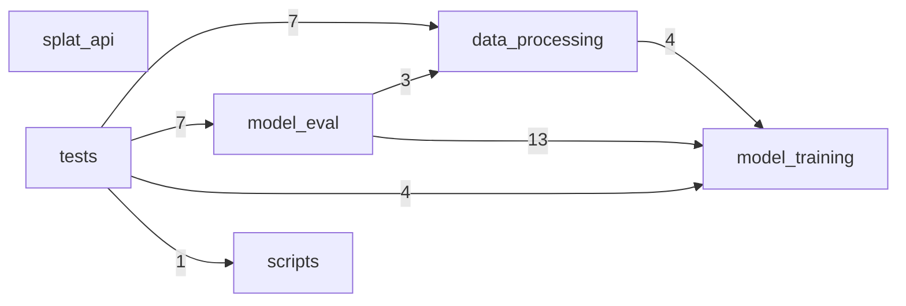

<!-- SPDX-FileCopyrightText: Copyright (c) 2026 NVIDIA CORPORATION & AFFILIATES. All rights reserved. -->
<!-- SPDX-License-Identifier: Apache-2.0 -->

# Repository map

Generated by `python -m splat_api.tools.repo_map`. Do not edit by hand.

The map exists to answer one question before touching the pipeline: which module owns a
step, and what does it drag in. Edges are static `import` statements found by AST walk,
so nothing here depends on a GPU or on the packages being installed.

## Packages

| Package | Modules | Lines | Role |
| --- | --- | --- | --- |
| `data_processing` | 21 | 5,535 | COLMAP prep, 3DGRUT reconstruction/render, captioning, ArtiFixer3D |
| `model_eval` | 22 | 3,831 | Inference entrypoint, eval datasets, metrics, checkpoint loading |
| `model_training` | 31 | 5,964 | Training stages, pipelines, transformer, schedulers, data loaders |
| `scripts` | 1 | 38 | Standalone helper scripts |
| `splat_api` | 33 | 9,570 | HTTP service wrapping the pipeline (this directory) |
| `tests` | 22 | 4,007 | Upstream repository tests |

## Package dependencies

Edge labels count distinct module-level imports crossing the boundary.

## Command-line entrypoints

| Module | Purpose |
| --- | --- |
| `python -m data_processing.captioning.generate_captions` | - |
| `python -m data_processing.prepare_colmap_artifixer_inputs` | Prepare a COLMAP scene for ArtiFixer inference. |
| `python -m data_processing.render_3dgrut_colmap` | Render a 3DGUT COLMAP checkpoint into the ArtiFixer reconstruction layout. |
| `python -m data_processing.run_artifixer3d` | Run ArtiFixer3D distillation and prepare ArtiFixer3D+ inference metadata. |
| `python -m data_processing.run_captioning` | Generate ArtiFixer prompt HDF5 files. |
| `python -m data_processing.run_sparse_reconstruction` | Generate ArtiFixer reconstruction HDF5 files. |
| `python -m data_processing.sparse_recon.convert_hdf5` | - |
| `python -m data_processing.sparse_recon.convert_to_video_hdf5` | Convert frame-based HDF5 files to the video-compressed HDF5 format used by training. |
| `python -m data_processing.sparse_recon.half_covisibility_sampling` | - |
| `python -m data_processing.sparse_recon.metric_alignment` | - |
| `python -m data_processing.sparse_recon.metric_alignment_nerfstudio` | Metric alignment for nerfstudio datasets without images.bin. |
| `python -m data_processing.trainval_test_split` | - |
| `python -m model_eval.compute_metrics_dl3dv` | Shared metrics computation for DL3DV test-scene eval, including ArtiFixer and DiFix variants. |
| `python -m model_eval.compute_metrics_nerfbusters` | Compute metrics for Nerfbusters evaluation outputs. |
| `python -m model_eval.dl3dv_distill_validation` | - |
| `python -m model_eval.export_checkpoint_pt` | - |
| `python -m model_eval.run_inference` | Inference script for eval. |
| `python -m model_training.diffusion_forcing` | - |
| `python -m model_training.distillation` | - |
| `python -m model_training.train` | - |
| `python -m scripts.download_dl3dv_scene` | - |
| `python -m splat_api.app.exporter` | Convert a 3DGRUT checkpoint into a 3DGS-compatible PLY splat. |
| `python -m splat_api.app.main` | ASGI application factory. |
| `python -m splat_api.tools.e2e_real` | End-to-end acceptance test against a real GPU and a real COLMAP scene. |
| `python -m splat_api.tools.fetch_models` | Fetch every weight the pipeline needs, so a container can be self-sufficient. |
| `python -m splat_api.tools.repo_map` | Generate a first-party import map of this repository. |
| `python -m tests.test_artifixer3d_distillation` | - |
| `python -m tests.test_camera_trajectories` | - |
| `python -m tests.test_checkpoint_loading` | - |
| `python -m tests.test_dl3dv_distill_validation` | - |
| `python -m tests.test_dl3dv_reconstruction_eval` | - |
| `python -m tests.test_download_dl3dv_scene` | - |
| `python -m tests.test_export_checkpoint_pt` | - |
| `python -m tests.test_nerfbusters_eval` | - |
| `python -m tests.test_pipeline_flags_keyword_only` | Regression test for the positional-flag swap in the KV-cache pipeline. |
| `python -m tests.test_prepare_colmap_artifixer_inputs` | - |
| `python -m tests.test_reconstructed_colmap_eval` | - |
| `python -m tests.test_scene_utils` | - |

## Most depended-on internal modules

| Module | Imported by |
| --- | --- |
| `splat_api.app.errors` | 15 |
| `splat_api.app.config` | 11 |
| `model_training.data.utils` | 9 |
| `data_processing.scene_utils` | 8 |
| `model_training.utils.train_utils` | 7 |
| `splat_api.app` | 7 |
| `model_training.net.transformer` | 6 |
| `splat_api.app.paths` | 6 |
| `model_training.data.scene_utils` | 5 |
| `model_training.utils.video_io` | 5 |
| `splat_api.app.jobstore` | 5 |
| `data_processing.camera_trajectories` | 4 |
| `model_training.constants` | 4 |
| `splat_api.tests.helpers` | 4 |
| `data_processing.nerfbusters` | 3 |

## Heavy third-party dependencies

Which modules pull in the expensive parts of the stack. A module that imports
`torch` or `threedgrut` cannot be loaded cheaply, which is why the API process
imports neither.

| Dependency | First-party modules that import it |
| --- | --- |
| `PIL` | 18: `data_processing.artifixer3d`, `data_processing.captioning.generate_captions`, `data_processing.prepare_colmap_artifixer_inputs`, `data_processing.sparse_recon.convert_hdf5`, `model_eval.compute_metrics_dl3dv`, `model_eval.compute_metrics_nerfbusters` (+12 more) |
| `accelerate` | 5: `model_training.distillation`, `model_training.trainers.dmd`, `model_training.trainers.trainer`, `model_training.trainers.trainer_base`, `model_training.utils.train_utils` |
| `diffusers` | 10: `data_processing.captioning.generate_captions`, `model_training.distillation`, `model_training.net.transformer`, `model_training.pipeline.kv_cache_pipeline`, `model_training.pipeline.pipeline`, `model_training.pipeline.pipeline_base` (+4 more) |
| `fastapi` | 6: `splat_api.app.main`, `splat_api.app.routes`, `splat_api.app.security`, `splat_api.tests.conftest`, `splat_api.tests.test_api`, `splat_api.tests.test_hardening` |
| `h5py` | 8: `data_processing.captioning.generate_captions`, `data_processing.sparse_recon.convert_hdf5`, `data_processing.sparse_recon.convert_to_video_hdf5`, `data_processing.trainval_test_split`, `model_eval.compute_metrics_dl3dv`, `model_eval.datasets.dl3dv_hdf5_eval` (+2 more) |
| `hydra` | 1: `data_processing.threedgrut_training` |
| `moge` | 1: `data_processing.sparse_recon.metric_alignment` |
| `numpy` | 26: `data_processing.artifixer3d`, `data_processing.camera_trajectories`, `data_processing.captioning.generate_captions`, `data_processing.prepare_colmap_artifixer_inputs`, `data_processing.sparse_recon.convert_hdf5`, `data_processing.sparse_recon.convert_to_video_hdf5` (+20 more) |
| `omegaconf` | 1: `data_processing.threedgrut_training` |
| `plyfile` | 2: `splat_api.app.exporter`, `splat_api.tools.e2e_real` |
| `pydantic` | 1: `splat_api.app.schemas` |
| `threedgrut` | 7: `data_processing.artifixer3d`, `data_processing.prepare_colmap_artifixer_inputs`, `data_processing.render_3dgrut_colmap`, `data_processing.sparse_recon.metric_alignment`, `data_processing.threedgrut_training`, `model_training.data.utils` (+1 more) |
| `torch` | 49: `data_processing.captioning.generate_captions`, `data_processing.sparse_recon.metric_alignment`, `data_processing.sparse_recon.metric_alignment_nerfstudio`, `model_eval.checkpoint_loading`, `model_eval.compute_metrics_dl3dv`, `model_eval.compute_metrics_nerfbusters` (+43 more) |
| `transformers` | 4: `data_processing.captioning.generate_captions`, `model_training.pipeline.kv_cache_pipeline`, `model_training.pipeline.pipeline`, `model_training.pipeline.pipeline_base` |

## Service module graph

```mermaid
flowchart TD
    splat_api_app["splat_api.app"]
    splat_api_app_archives["archives"]
    splat_api_app_colmap_input["colmap_input"]
    splat_api_app_config["config"]
    splat_api_app_errors["errors"]
    splat_api_app_exporter["exporter"]
    splat_api_app_jobstore["jobstore"]
    splat_api_app_main["main"]
    splat_api_app_paths["paths"]
    splat_api_app_pipeline["pipeline"]
    splat_api_app_ratelimit["ratelimit"]
    splat_api_app_routes["routes"]
    splat_api_app_scheduler["scheduler"]
    splat_api_app_schemas["schemas"]
    splat_api_app_security["security"]
    splat_api_app_archives --> splat_api_app_config
    splat_api_app_archives --> splat_api_app_errors
    splat_api_app_archives --> splat_api_app_paths
    splat_api_app_colmap_input --> splat_api_app_errors
    splat_api_app_colmap_input --> splat_api_app_paths
    splat_api_app_jobstore --> splat_api_app_errors
    splat_api_app_main --> splat_api_app
    splat_api_app_main --> splat_api_app_config
    splat_api_app_main --> splat_api_app_errors
    splat_api_app_main --> splat_api_app_jobstore
    splat_api_app_main --> splat_api_app_ratelimit
    splat_api_app_main --> splat_api_app_scheduler
    splat_api_app_main --> splat_api_app_schemas
    splat_api_app_main --> splat_api_app_security
    splat_api_app_paths --> splat_api_app_errors
    splat_api_app_pipeline --> splat_api_app_config
    splat_api_app_routes --> splat_api_app
    splat_api_app_routes --> splat_api_app_archives
    splat_api_app_routes --> splat_api_app_colmap_input
    splat_api_app_routes --> splat_api_app_config
    splat_api_app_routes --> splat_api_app_errors
    splat_api_app_routes --> splat_api_app_jobstore
    splat_api_app_routes --> splat_api_app_paths
    splat_api_app_routes --> splat_api_app_scheduler
    splat_api_app_routes --> splat_api_app_schemas
    splat_api_app_routes --> splat_api_app_security
    splat_api_app_scheduler --> splat_api_app
    splat_api_app_scheduler --> splat_api_app_config
    splat_api_app_scheduler --> splat_api_app_errors
    splat_api_app_scheduler --> splat_api_app_jobstore
    splat_api_app_scheduler --> splat_api_app_paths
    splat_api_app_schemas --> splat_api_app_errors
    splat_api_app_schemas --> splat_api_app_paths
    splat_api_app_security --> splat_api_app_config
    splat_api_app_security --> splat_api_app_errors
    splat_api_app_security --> splat_api_app_ratelimit
```

